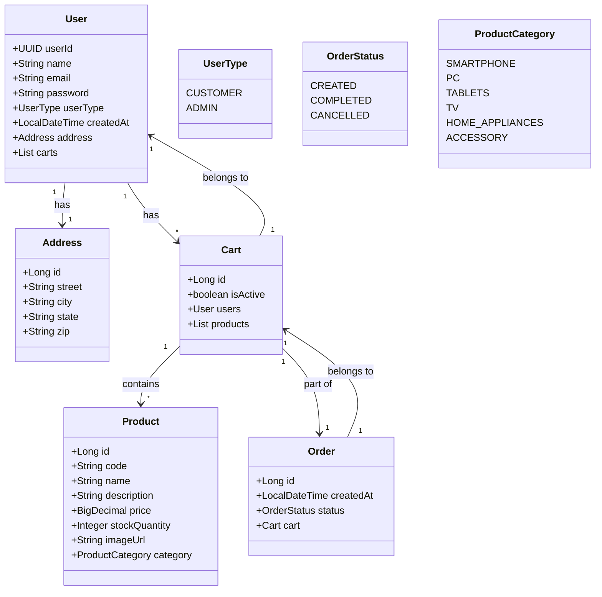

# RESTFul E-commerce System API

This repository contains the source code for an e-commerce system developed in Java with Spring Boot. The system allows users to view products, place orders, manage shopping carts, and make payments.

## Class Diagram



## System Flow

### 1. User Authentication and Registration

- **User Registration**: The system allows new users to register by sending a `POST` request to the `/register` endpoint. Registration includes information such as name, email, password, and address. The system returns a confirmation message after successful registration.

- **User Login**: After registration, users can log in with their credentials by sending a `POST` request to `/auth`. The system returns a JWT token that will be used to authenticate the users in subsequent interactions with the API.

### 2. Product Management

- **List Products**: The users can view the list of all products available in the system by sending a `GET` request to `/product/products`. The system returns a list of products with details such as name, price, and category.

- **Product Details**: To view detailed information about a specific product, the users can send a `GET` request to `/product/{id}`.

- **Product Administration**: Administrators have permissions to create new products (`POST /product`), update product information (`PUT /product/update/{id}`), and remove products from the system (`DELETE /product/delete/{id}`).

### 3. Shopping Cart

- **Create Cart**: The system allows the users to create a shopping cart associated with their profile by sending a `POST` request to `/cart`. A cart is created empty and is active until it is disabled or completed.

- **Add Products to Cart**: The users can add products to the existing cart by sending a `POST` request to `/cart/add/{cartId}/{productId}`, where the parameters are the cart ID and the product ID.

- **View Cart**: The users can check the items in their active cart by sending a `GET` request to `/cart/{cartId}`.

- **Disable Cart**: If the users no longer wants to use a cart, they can disable it by sending a `PUT` request to `/cart/disabled/{cartId}`.

### 4. Order Processing

- **Create Order**: When the users wishes to finalize a purchase, they can create an orderShopping based on an active cart by sending a `POST` request to `/orderShopping`. The system checks the stock quantity of each product, and if available, creates the orderShopping with an initial status of `CREATED`.

- **Track Order**: The orderShopping can change its status to `COMPLETED` when payment is made or `CANCELLED` if the users opts to cancel the purchase.

### 5. User Management

- **Update User**: The users can update their personal information, such as email or address, by sending a `PUT` request to `/users/update/{id}`.

- **View Users**: Administrators can list all registered users by sending a `GET` request to `/users/users`, or search for a specific users by ID (`GET /users/{id}`) or email (`GET /users/email/{email}`).

### 6. Authorization and Permissions

- The system uses OAuth to protect routes and verify if the users is authenticated before accessing or modifying resources. Only authorized users can view or edit products, carts, and orders.

### 7. API Call Examples

#### User Registration

```json
POST /register
{
    "name": "John Doe",
    "email": "john.doe@example.com",
    "password": "strongpassword",
    "street": "123 Main St",
    "city": "Somewhere",
    "state": "CA",
    "zip": "12345"
}
```

#### User Login

```json
POST /auth
{
    "email": "john.doe@example.com",
    "password": "strongpassword"
}
```

#### List Products

```json
GET /product/products
```

#### Create Order

```json
POST /orderShopping
{
    "cartId": 1,
    "productId": 2
}
```

### Final Remarks

This system utilizes token-based JWT authentication, ensuring the security of operations. The shopping flow is integrated with product management, carts, and orders, providing an efficient and organized experience for end-users and administrators.
