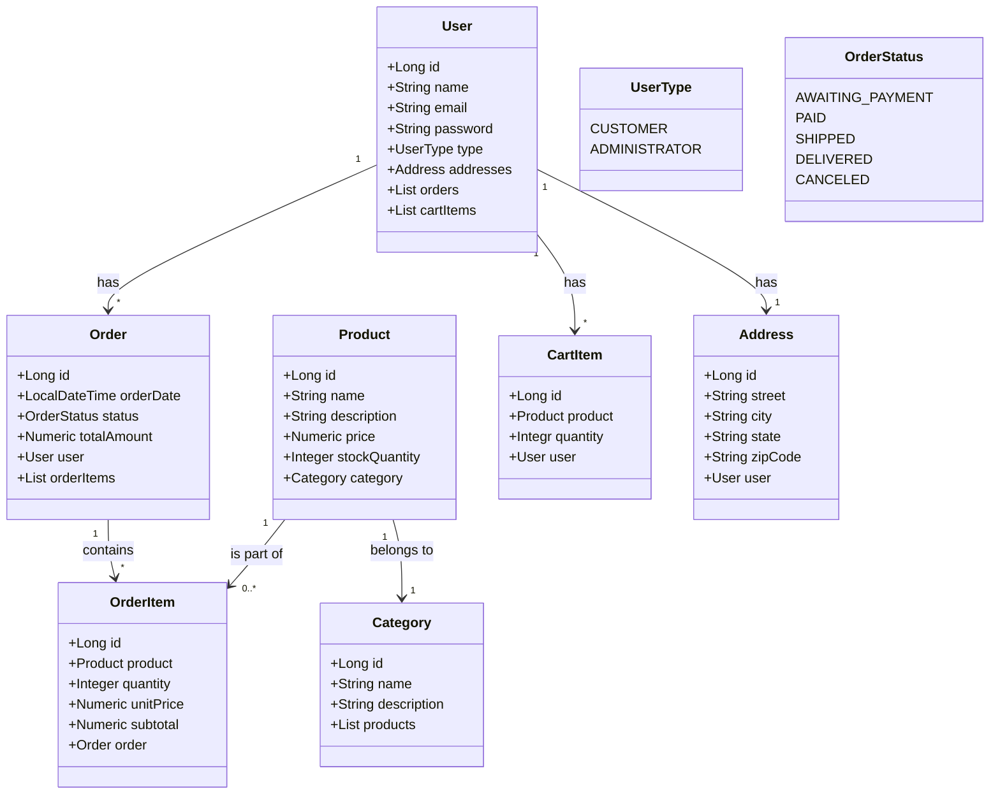

# RESTFul E-commerce System API
This repository contains the source code for an e-commerce system developed in Java with Spring Boot. The system allows users to view products, place orders, manage order carts and make payments.

## Class Diagram

